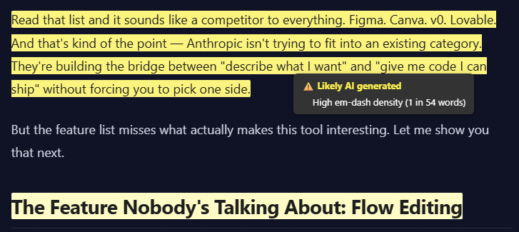

# AI Detector

Tampermonkey script that highlights text likely written by an AI.

## Installation

1. Install [Tampermonkey](https://www.tampermonkey.net/).
2. Add `script.js` as a new userscript.

## Usage

The script runs automatically on all pages. Suspicious text appears with a pale yellow background. Hover for details.

- **Settings**: Tampermonkey menu → "AI Highlighter Settings" → adjust threshold to a comfortable level.
- **Exclude current site**: Open settings and click "Exclude This Site"

## Notes

Detection uses surface heuristics only:

- No server calls needed;
- False positives are expected;
- Heuristics may (probably will) become outdated as AI writing evolves, but maybe I will add new ones over time.